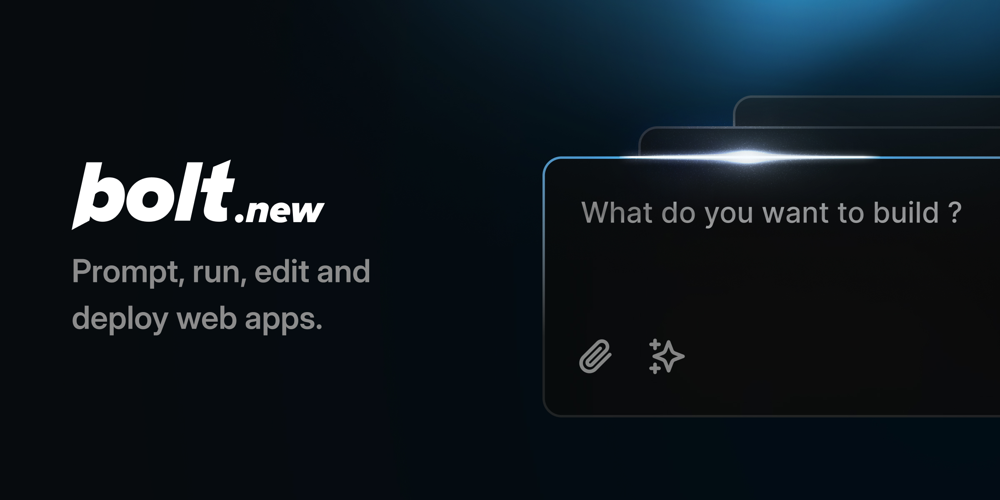
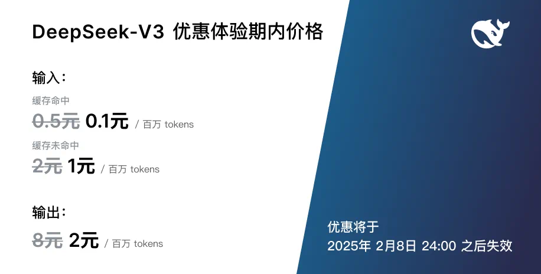

# 🎉 DeepSeek-V3 正式发布，已在网页端和 API 全面上线，性能领先，速度飞跃，点击查看详情

# Bolt.new: 基于AI驱动的浏览器全栈Web开发

Bolt.new是一个AI驱动的Web开发代理，允许您直接在浏览器中提示、运行、编辑和部署全栈应用程序——无需本地设置。如果您想使用Bolt开源代码库构建自己的AI驱动的Web开发代理，[点击这里开始！](./CONTRIBUTING.md)

# 🚀 本项目基于bolt.new修改，集成了deepseek-v3的强大能力！

## 🔥 重点亮点：

1. 集成了deepseek-v3模型，大幅提升了代码生成和理解能力
2. 支持更复杂的项目结构和多语言开发
3. 优化了用户交互界面，提供更直观的AI辅助编程体验
4. 增加一键 **导出源码**的能力

👨‍💻 欢迎大家亲身体验这个革命性的AI驱动开发工具！

## Bolt.new的独特之处

Claude、v0等确实很棒，但你无法安装软件包、运行后端或编辑代码。这就是Bolt.new的突出之处：

- **浏览器中的全栈开发**：Bolt.new将尖端AI模型与由**StackBlitz的WebContainers**驱动的浏览器内开发环境集成。这允许您：

  - 安装和运行npm工具和库（如Vite、Next.js等）
  - 运行Node.js服务器
  - 与第三方API交互
  - 从聊天中部署到生产环境
  - 通过URL分享您的作品

- **具有环境控制的AI**：与传统开发环境中AI只能辅助代码生成不同，Bolt.new赋予AI模型对整个环境的**完全控制**，包括文件系统、node服务器、包管理器、终端和浏览器控制台。这使AI代理能够处理从创建到部署的整个应用生命周期。

无论您是经验丰富的开发人员，还是产品经理或设计师，Bolt.new都能让您轻松构建生产级的全栈应用程序。

对于有兴趣使用WebContainers构建自己的AI驱动开发工具的开发人员，请查看本仓库中的开源Bolt代码库！

## 使用技巧

以下是一些充分利用Bolt.new的技巧：

- **明确指定您的技术栈**：如果您想使用特定的框架或库（如Astro、Tailwind、ShadCN或任何其他流行的JavaScript框架），请在初始提示中提及它们，以确保Bolt正确搭建项目。

- **使用增强提示图标**：在发送提示之前，尝试点击"增强"图标，让AI模型帮助您完善提示，然后编辑结果再提交。

- **先搭建基础，再添加功能**：在深入更高级的功能之前，确保应用程序的基本结构已就位。这有助于Bolt理解您项目的基础，并确保在构建更高级功能之前一切都正确连接。

- **批量简单指令**：通过将简单指令组合到一条消息中来节省时间。例如，您可以一次性要求Bolt更改配色方案、添加移动响应性并重启开发服务器，这样可以显著节省时间并减少API信用消耗。

## 常见问题

**我在哪里注册付费计划？**  
Bolt.new可以免费开始使用。如果您需要更多AI令牌或想要私有项目，可以在[Bolt.new](https://bolt.new)设置中购买付费订阅，设置位于应用程序的左下角。

**如果我达到免费使用限制会怎样？**  
一旦达到每日免费令牌限制，AI交互将暂停，直到第二天或您升级计划。

**Bolt是否处于测试阶段？**  
是的，Bolt.new正处于测试阶段，我们正根据反馈积极改进它。

**如何报告Bolt.new的问题？**  
查看[问题部分](https://github.com/stackblitz/bolt.new/issues)来报告问题或请求新功能。请使用搜索功能检查是否有人已经提交了相同的问题/请求。

**Bolt目前支持哪些框架/库？**  
Bolt.new支持大多数流行的JavaScript框架和库。如果它可以在StackBlitz上运行，那么它也可以在Bolt.new上运行。

**如何确保我的框架/项目在Bolt中运行良好？**  
我们很高兴与JavaScript生态系统合作，以改进Bolt中的功能。通过[hello@stackblitz.com](mailto:hello@stackblitz.com)联系我们，讨论如何合作！
